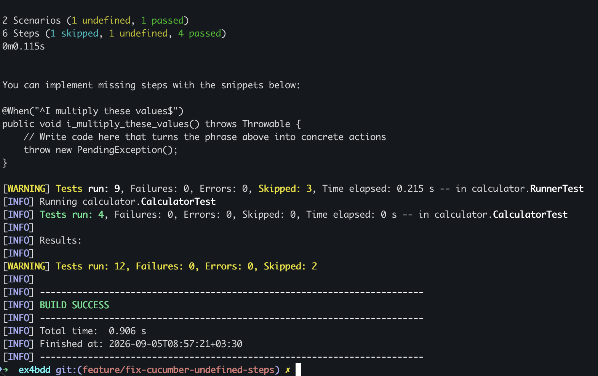
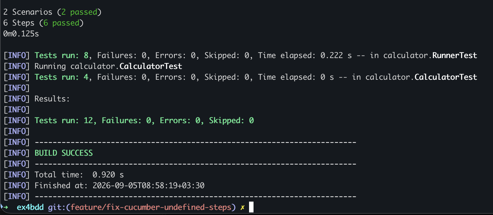
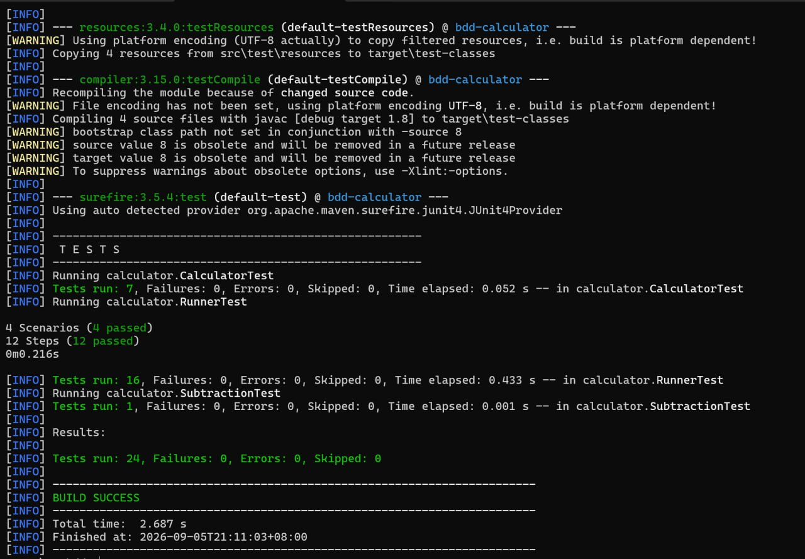
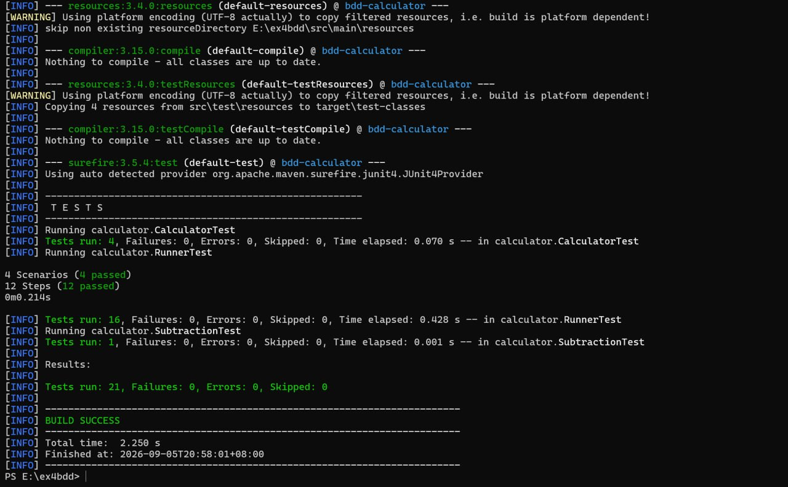
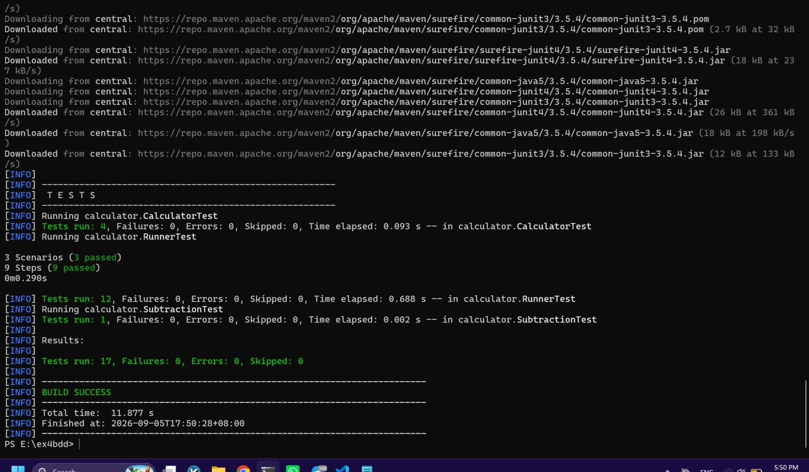

# SE Lab - Experiment 4: Behavior-Driven Development (BDD)

## bdd-calculator

پروژه bdd-calculator برای آزمایش چهارم درس آزمایشگاه مهندسی نرم‌افزار پیاده‌سازی شده است. هدف اصلی این آزمایش آشنایی عملی با رویکرد توسعه مبتنی بر رفتار (Behavior-Driven Development - BDD)، نحوه نگارش سناریوهای تست با زبان Gherkin، استفاده از فریم‌ورک Cucumber در کنار JUnit و Maven در محیط توسعه IntelliJ، و همچنین عیب‌یابی و اصلاح الگوهای Regular Expression در Step Definition ها بوده است.

## اعضای تیم

سارا قضاوی - 402106348  
زهرا قصابی - 402106337  

هر دو عضو تیم در طول توسعه با حساب Git خودشان مشارکت کرده‌اند و branch ها و commit های هر دو نفر روی GitHub و Hamgit ثبت شده‌اند.

## لینک‌های پروژه

* **GitHub Repository:**  
  https://github.com/sarahghazavi/SE-Lab-Ex4-BDD

* **Hamgit Repository:**  
  https://hamgit.ir/selab-team-ghazavi-ghassabi/selab-bdd-calculator


# معرفی پروژه و مفاهیم BDD

در این آزمایش هدف اصلی ما این بود که با مفاهیم توسعه مبتنی بر رفتار یا همان BDD آشنا شویم. برخلاف TDD که بیشتر تمرکزش روی تست کردن کدهای فنی برنامه از دید برنامه‌نویس است، BDD می‌آید و رفتار سیستم را از دید کاربر و صورت مسئله بررسی می‌کند. در این روش سناریوهای تست به زبان ساده و قابل فهم (زبان Gherkin) با استفاده از کلمات کلیدی مثل Given و When و Then نوشته می‌شوند تا همه اعضای تیم و حتی افراد غیرفنی بتوانند آن را درک کنند. برای اجرای این سناریوها در جاوا از فریم‌ورک Cucumber استفاده کردیم که در کنار JUnit و Maven به ما کمک می‌کند سناریوهای متنی را به تست‌های واقعی تبدیل و اجرا کنیم.


# ساختار پروژه

پروژه شامل ساختار استاندارد Maven به شرح زیر است:

```text
ex4bdd/
├── pom.xml
├── README.md
├── TEST_COVERAGE.md
├── docs/
│   ├── 1.jpeg
│   ├── 2.jpeg
│   ├── 3.jpeg
│   ├── 4.png
│   └── 5.png
└── src/
    ├── main/
    │   └── java/
    │       └── calculator/
    │           └── Calculator.java
    └── test/
        ├── java/
        │   └── calculator/
        │       ├── CalculatorTest.java
        │       ├── MyStepdefs.java
        │       ├── RunnerTest.java
        │       └── SubtractionTest.java
        └── resources/
            └── features/
                ├── calculator.feature
                ├── division.feature
                ├── multiplication.feature
                └── subtraction.feature
```


# مراحل اجرای آزمایش

## بخش اول: مطالعه و پیاده‌سازی اولیه مستند BDD Example

در گام نخست، پروژه Maven با نام `bdd-calculator` ایجاد گردید و وابستگی‌های مورد نیاز به فایل `pom.xml` اضافه شدند:

```xml
<dependencies>
    <dependency>
        <groupId>info.cukes</groupId>
        <artifactId>cucumber-junit</artifactId>
        <version>1.2.5</version>
    </dependency>
    <dependency>
        <groupId>junit</groupId>
        <artifactId>junit</artifactId>
        <version>4.12</version>
        <scope>test</scope>
    </dependency>
    <dependency>
        <groupId>info.cukes</groupId>
        <artifactId>cucumber-java</artifactId>
        <version>1.2.5</version>
        <scope>test</scope>
    </dependency>
</dependencies>
```

همچنین تنظیمات کامپایلر جاوا روی نسخه 1.8 قرار گرفت:

```xml
<properties>
    <maven.compiler.source>1.8</maven.compiler.source>
    <maven.compiler.target>1.8</maven.compiler.target>
</properties>
```

پس از علامت‌گذاری پوشه `src/test/resources` به عنوان **Test Resources Root**، اولین سناریوی تست در فایل `calculator.feature` برای عملیات جمع تعریف شد. سپس با استفاده از قابلیت‌های نگاشت Cucumber در محیط IntelliJ، کدهای اولیه مربوط به `MyStepdefs.java` و منطق برنامه در `Calculator.java` پیاده‌سازی شدند. کلاس `RunnerTest.java` نیز با آنوتیشن `@RunWith(Cucumber.class)` و `@CucumberOptions` برای اجرای خودکار تست‌ها پیکربندی گردید.


## بخش دوم: تحلیل و رفع مشکل Undefined Steps در Scenario Outline

مطابق با بخش دوم صورت تمرین و انتهای مستند `Example.pdf`، هنگام اضافه کردن سناریوی الگویی (`Scenario Outline`) به صورت زیر:

```gherkin
Scenario Outline: add two numbers
    Given Two input values, <first> and <second>
    When I add the two values
    Then I expect the result <result>

  Examples:
    | first | second | result |
    | 1     | 12     | 13     |
    | -1    | 6      | 5      |
    | 2     | 2      | 4      |
```

هنگام اجرای تست‌ها با وضعیت `undefined` در برخی از موارد تست مواجه شدیم.

ردیف دوم جدول داده‌ها که شامل ورودی منفی `| -1 | 6 | 5 |` بود، و همچنین سناریوهایی که تعریف عبارت step برای آن‌ها در کلاس `MyStepdefs.java` غایب بود (نظیر `@When("^I multiply these values$")`) دچار مشکل شدند.



دلیل این خطا دو چیز بود. اول اینکه در امضای متد `@Given("^Two input values, (\\d+) and (\\d+)$")` از الگوی `(\\d+)` استفاده شده بود که فقط اعداد صحیح مثبت را مطابقت می‌دهد و علامت منفی `-` در عدد `-1` با آن مطابقت پیدا نمی‌کرد. دوم اینکه برای برخی گام‌های جدید اضافه شده، متدی در `MyStepdefs.java` تعریف نشده بود.

برای حل این مشکل، الگوی Regular Expression در آنوتیشن‌های `@Given` و `@Then` اصلاح شد تا از اعداد منفی نیز پشتیبانی کند (`(-?\\d+)`). همچنین متدهای غایب در `MyStepdefs.java` پیاده‌سازی شدند:

```java
@Given("^Two input values, (-?\\d+) and (-?\\d+)$")
public void twoInputValuesAnd(int arg0, int arg1) {
    value1 = arg0;
    value2 = arg1;
}

@Then("^I expect the result (-?\\d+)$")
public void iExpectTheResult(int expected) {
    Assert.assertEquals(expected, result);
}
```

پس از اعمال این تغییرات، تمامی سناریوها به طور کامل پاس شدند:




## بخش سوم: پیاده‌سازی کامل عملیات حسابداری (ضرب، تقسیم، تفریق و توان)

مطابق با خواسته بخش سوم تمرین، سناریوهای لازم برای عملیات‌های ضرب (`*`)، تقسیم (`/`)، تفریق (`-`) و توان (`^` / `**` که با کمک عملگر ضرب پیاده‌سازی می‌شود) به صورت سناریوی عادی و `Scenario Outline` تعریف شدند.

فایل‌های Feature ایجادشده شامل موارد زیر است:
* `src/test/resources/features/calculator.feature`
* `src/test/resources/features/subtraction.feature`
* `src/test/resources/features/multiplication.feature`
* `src/test/resources/features/division.feature`

نمونه سناریوهای تعریف‌شده به همراه `Scenario Outline` مطابق نمونه صورت تمرین:

```gherkin
Feature: Calculator Operations

  Scenario Outline: Calculate result of binary operations
    Given Two input values, <first> and <second>
    When I operate with "<opt>"
    Then I expect the result <result>

  Examples:
    | first | second | opt | result |
    | 6     | 2      | *   | 12     |
    | 6     | 2      | /   | 3      |
    | 6     | 2      | ^   | 36     |
```

با اجرای دستور `mvn test` تمامی تست‌های واحد JUnit و سناریوهای Cucumber با موفقیت اجرا شدند.








# استفاده از هوش مصنوعی (AI Assistance)

در طول انجام این آزمایش برای درک بهتر مفاهیم BDD و عیب‌یابی بخش‌های مختلف از هوش مصنوعی کمک گرفتیم. پرامپت‌ها را طوری مطرح کردیم که سوالات کلی و مفهومی باشند تا اصل کدنویسی و پیاده‌سازی کار دست خودمان بماند.

نمونه پرامپت‌های استفاده شده:

1. **پرامپت ۱:**  
   > چطوری توی فایل pom.xml وابستگی‌های cucumber و junit رو ست کنم که BDD توی intellij بدون مشکل کار کنه؟

2. **پرامپت ۲:**  
   > توی زبان gherkin فرق اصلی بین scenario با scenario outline چیه و این جدول examples رو دقیقا چطوری باید بنویسم؟

3. **پرامپت ۳:**  
   > تستای cucumber موقع اجرای scenario outline برام undefined میشن و اعداد منفی رو نمی‌شناسن، چطوری Regex رو تغییر بدم که کار کنه؟

4. **پرامپت ۴:**  
   > توی فایل RunnerTest چطوری آدرس فایل‌های feature و stepdef ها رو بدیم که با junit بتونیم همه تست‌ها رو یکجا اجرا کنیم؟


# Git Workflow

در این پروژه از یک ساختار شاخه‌بندی مشخص بر پایه feature branch استفاده کردیم. شاخه `main` شاخه اصلی پروژه است و تمام قابلیت‌ها در branch های جداگانه توسعه داده شده و پس از تکمیل، مستقیما به شاخه `main` ادغام (Merge) شدند.

شاخه‌های feature ایجاد شده در طول پروژه:

```text
feature/maven-setup
feature/cucumber-junit-config
feature/calculator-core
feature/addition-feature
feature/addition-step-definitions
feature/cucumber-runner
feature/calculator-unit-tests
feature/multiplication-operation
feature/fix-cucumber-undefined-steps
feature/division-operation
feature/subtraction-operation
feature/subtraction-feature-file
feature/review-test-coverage
feature/improve-project-documentation
feature/final-report
```


# Commit History

تاریخچه Commitهای پروژه:

```text
dcf5665 Add final test results and conclusion
eb02a56 Add AI assistance report section
7bfa927 Add commit history and task management report
273a699 Add Git workflow documentation
a2d4cbe Document BDD implementation and test workflow
09fc988 Add team and repository information to README
0aae0af Add project introduction section to README
f62076b Add test coverage review documentation
2931b53 Increase calculator test coverage
d67f192 Add subtraction step definition and unit test
642d360 Create subtraction feature scenario
80dd7aa Add subtraction unit test
2efe11b Document subtraction operation implementation
59e3410 Add division feature scenario and steps
ebb88fe Fix Cucumber undefined multiplication step
93f8b04 Add multiplication feature scenario and steps
30b0d1f Add calculator unit tests
e96c90c Add Cucumber runner and configure test execution
00a9aac Implement addition step definitions
18040a3 Create addition feature scenario
e641216 Implement calculator core operations
e0437c6 Configure Cucumber and JUnit dependencies
8f456e7 Create Maven project structure
8db7d31 Initialize BDD calculator project
```


# Kanban Board

برای پیشبرد منظم پروژه، کارها را روی برد کانبان مدیریت کردیم و وظایف مختلف از ستون Backlog تا In Progress و در نهایت Done منتقل شدند.


# پاسخ پرسش‌های آزمایش

## ۱. توسعه مبتنی بر رفتار (BDD) چیست و چه تفاوت‌هایی با توسعه آزمون‌محور (TDD) دارد؟

در واقع رویکرد BDD یا همان توسعه مبتنی بر رفتار، یک گام جلوتر از TDD یا توسعه آزمون‌محور است. در TDD برنامه‌نویس ابتدا تست‌های فنی متدها را می‌نویسد تا از صحت عملکرد کدهای خودش مطمئن بشود، اما در BDD تمرکز اصلی روی رفتار کلی سیستم از دید کاربر نهایی و ذینفعان مسئله است. سناریوهای BDD به زبان طبیعی و قابل فهم برای همه نوشته می‌شوند تا فاصله بین فهم مشتری و کدهای برنامه‌نویس از بین برود.

## ۲. ساختار و نحوه‌ی نگارش فایل‌های Feature و ساختار Gherkin چگونه است؟

فایل‌های feature با استفاده از زبان Gherkin نوشته می‌شوند که ساختار خیلی ساده و منطقی دارد. در ابتدای فایل، عنوان قابلیت با کلیدواژه Feature مشخص می‌شود و سپس سناریوهای مختلف قرار می‌گیرند. هر سناریو شامل گام‌های Given برای تعیین شرایط اولیه، When برای انجام کنش یا عمل کاربر، و Then برای بررسی و تایید نتیجه نهایی است. همچنین اگر بخواهیم یک سناریو را با ورودی‌های متعدد تست کنیم از Scenario Outline به همراه جدول Examples استفاده می‌کنیم.

## ۳. نقش Cucumber، Step Definitions و Regex در نگاشت سناریوها به کد چیست؟

ابزار Cucumber نقش واسط را بین متون نوشتاری فایل feature و کدهای جاوا ایفا می‌کند. این ابزار عبارات موجود در سناریوها را با الگوهای Regular Expression یا همان Regex که بالای متدها در فایل Step Definitions تعریف شده‌اند تطبیق می‌دهد. با پیدا شدن الگوی مشابه، Cucumber متد مربوطه را اجرا کرده و مقادیر متغیر داخل متن را به عنوان ورودی به متد جاوا پاس می‌دهد.

## ۴. علت بروز خطای Undefined Step چیست و چگونه برطرف می‌شود؟

خطای undefined زمانی رخ می‌دهد که Cucumber نتواند برای یکی از گام‌های نوشته شده در فایل feature کدی را پیدا کند. دلیل اصلی این موضوع معمولاً دو چیز است: یا کلاً متدی برای آن گام نوشته نشده، یا الگوی Regex نوشته شده با ورودی‌ها مطابقت ندارد. مثلا اگر Regex فقط اعداد مثبت را پوشش دهد (`\d+`) و ما عدد منفی مثل `-1` بدهیم، Cucumber گام را پیدا نکرده و خطای undefined می‌دهد که با تغییر الگوی Regex به `(-?\d+)` این مشکل کاملا برطرف می‌شود.

## ۵. کاربرد Scenario Outline و جدول Examples چیست؟

وقتی می‌خواهیم یک سناریوی تست یکسان را بارها با مقادیر و ورودی‌های مختلف اجرا کنیم، به جای تکرار کدهای سناریو از Scenario Outline استفاده می‌کنیم. در این حالت متغیرها داخل علامت‌های زاویه‌ای قرار می‌گیرند و مقادیر واقعی ورودی و خروجی در جدول Examples قرار داده می‌شوند. این کار باعث می‌شود کد ما بسیار خلوت‌تر شده و تست‌های داده‌محور به راحتی اجرا شوند.

## ۶. چگونگی پیکربندی JUnit Runner و تنظیمات `@CucumberOptions`

برای اینکه بتوانیم سناریوهای Cucumber را به صورت خودکار با JUnit اجرا کنیم، یک کلاس با نام RunnerTest می‌سازیم و آن را با آنوتیشن `@RunWith(Cucumber.class)` مشخص می‌کنیم. سپس با استفاده از آنوتیشن `@CucumberOptions` مسیر فایل‌های feature و مسیر پکیج Step Definitionها را تعیین می‌کنیم تا JUnit بتواند تمام سناریوها را شناسایی کرده و اجرا نماید.

## ۷. نقش تست‌های واحد (Unit Tests) در کنار تست‌های رفتارمحور (BDD) چیست؟

تست‌های BDD رفتار سطح بالای سیستم و سناریوهای کاربری را بررسی می‌کنند تا مطمئن شویم برنامه همان کاری را انجام می‌دهد که انتظار می‌رود. اما تست‌های واحد یا Unit Testها با فریم‌ورکی مثل JUnit صحت عملکرد دقیق توابع و متدهای داخلی کلاس Calculator را به صورت ایزوله می‌سنجند. وجود هر دو نوع تست در کنار هم باعث می‌شود هم از عملکرد فنی کدهامان و هم از رفتار درست سیستم اطمینان حاصل کنیم.


# نتیجه‌گیری

در این آزمایش موفق شدیم مفاهیم BDD را به صورت عملی با Cucumber و JUnit پیاده‌سازی کنیم، سناریوهای مختلف ماشین حساب را بنویسیم، خطاهای الگوی Regex را برطرف کنیم و تمام تست‌ها را با موفقیت پاس نماییم.
